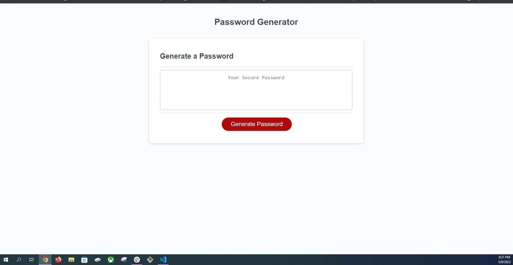

# challenge-password-generator
## Purpose
This website I made is a random password generator. You will be prompted to give a password length between 8 and 128 characters.
You will then be given 4 prompts to see what characters make up your randomly generated password. (lower case, upper case, numeric, special characters)
Depending on what you confirm will be in the password will decide on what characters will go into the generation of the random password.

## Built with
* HTML
* CSS
* JavaScript

## Image

## Website
https://github.com/DanielCConlon/challenge-password-generator

## Github Pages
https://danielcconlon.github.io/challenge-password-generator/